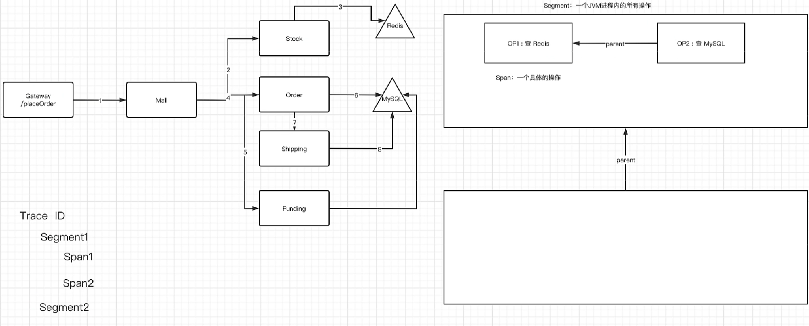

# 链路追踪

## 1. 基本概念

* Trace：表示一整条链路（跨线程、跨进程的所有segment的集合）
* Segment：表示一个JVM进程内的一个线程的所有操作的集合
* Span：表示具体的某一个操作

## 2. TraceSegment

* 组成Trace的基本单位：Trace不是一个具体的数据模型，而是多个Segment串起来表示的逻辑对象
* TraceSegmentRef：用于引用ParentSegment
* 所有的Span维护在一个LinkedList中
* relatedGlobalTraceId表示当前Segment所在的Trace
* isSizeLimited如果为true，表示当前这个线程内发生的操作次数超过了配置值，segment丢弃了一部分操作

## 3. Span

* AsyncSpan：最顶层的Span定义，用于异步插件
* AbstractSpan：Span的骨架
* AbstractTracingSpan：用于链路追踪的Span模型
* StackBasedTracingSpan：基于虚拟栈结构的Span
* NoopXxxSpan：表示一个不会被记录的操作；为了确保Span整个工作流程的统一